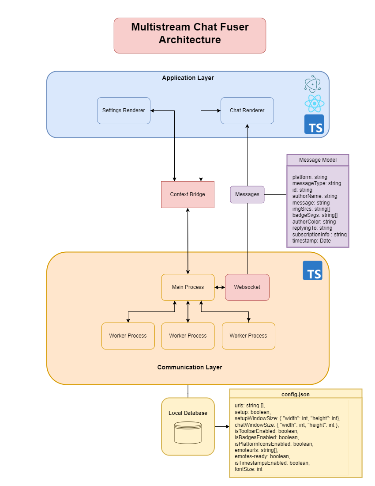

Multistream Chat Fuser is a free-to-use application combining multiple chats from Twitch, Youtube, and Kick into a single, cohesive chat.

## Why Multistream Chat Fuser?
Multistream Chat Fuser addresses the absence of a non-paid, multi-platform chat consolidation service. Whether you're a creator looking to streamline interactions or a viewer eager to participate in multiple chats simultaneously, this application offers a convenient, cost-free solution.

## Features
- Currently supports integrating chat from Twitch, Kick, and YouTube.
- Operates entirely on your machine, ensuring full control without external API dependencies.
- Customize your chat
- Supports default emotes, subscription notifications, highlighted messages, and reply messages from Twitch.
- Send messages directly to Twitch chats.
- 7TV Emotes

## How to Use Multistream Chat Fuser
1. Download latest release from our releases page.
2. Launch the application.
3. Input chat URLs in the "Chat Linking" inside "General" Tab.
4. Input 7TV User URL in the "Emote" Tab.
5. Adjust custom settings in the "Appearence Tab."
6. Click "Fuse Chats"

## How does it work?
The Multistream Chat application aggregates messages from multiple chat platforms into a single interface, leveraging modern web technologies and architectural design principles for efficient real-time communication and data management.

### 1. Chat Message Rendering

- On application launch, the Chat Renderer initializes, sending a message to the Main Process to set up a WebSocket server and listens for that Websocket connection. The Main Process spawns Chromium worker processes for each chat service URL provided by the user.

- Each worker process extracts chat messages from the DOM of the target chat service. These messages are then serialized and transmitted to the WebSocket server.

- The WebSocket server receives these messages and forwards them to the Chat Renderer, where they are dynamically rendered into the unified chat interface.

### 2. Settings Management and Data Persistence

- The Settings Render provides an interface for the user to configure preferences and chat service URLs. Interaction with this renderer involves real-time updates to application settings and preferences.

- Changes to settings are communicated to the main process via a context bridge, ensuring a secure and efficient transfer of data between renderer processes and the main application process.

- The main process acts as the central coordinator, handling data flow between the Chat Renderer, Settings Renderer, and the local `%appdata%` database. It manages the persistence of user settings and application state, facilitating data retrieval and updates as required.

- User settings and preferences are stored in the local database, allowing for quick retrieval and application of configurations upon subsequent launches.

## Contributing to the Project
Interested in contributing? Here's how you can help:

1. Clone the Repository: Access our GitHub repository.
2. Run `npm install` to install necessary dependencies.
3. Make your changes and test them using `npm run dev`.

